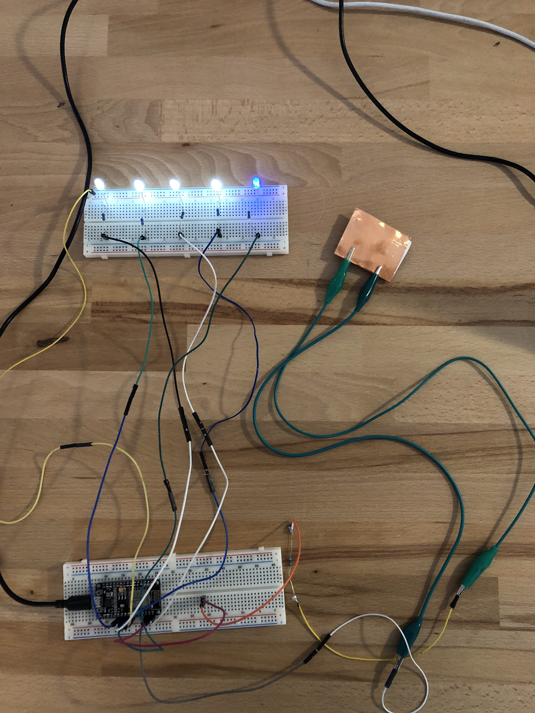

# Climbing stairs...Rocky-style! - Beat Steps Demo

## Demo description

This is the repository for the 'Beat Steps' prototype built in the Interface Design course WS19/20.

### The idea
Two interactive steps, with two touch sensor plates each, that play a song when you step on them. The faster the user goes, the more beats per second are playing until the song is finished. Thereby, the steps provide the option for a small workout implemented at the stairs next to the Bavaria Statue. Our goal was to motivate people passing by to actually increase their interactivity and level of engagement outdoors, while being mindful i.e. aware of their environment. Besides the user, “Beat Steps” also attracts bystanders and, hence, increases the sense of community. Also, through the word of mouth “Beat Steps” can actually become a workout destination for people who usually do sports outdoors. This is how we want to increase the attractiveness of the area around the Bavaria Statue.

### Technical details of the physical demo
The demo constis of a NodeMCU ESP8266 PCB board, LED lights, copper wire and connecting cables.
The demo is built on two breadboards. Both breadboards are mounted into the physical prototype, which consits of two wooden plates that are located on a stair. Those two plates consist if a total number of four footsteps-plates. Each of them is coated in copper wire, which gives them the functionality to act as a sensor. The copper wire serves as conductive material. This means that everytime someone touches the footsteps, a signal is sent to the controler of the demo.

The first breadboard consits of the NodeMCU. It is mounted into the lower part of the upper wooden plate and hidden within a wooden box. The second breadboard consists of the five LED lights that are also mounted into a wooden box, making only the lightbulbs visible.

The two breadboards with the NodeMCU and the LED Lights are connected through jumper wires. Finally, the NodeMCU has an additional outgoing jumper wire which connects it to a crocodile clip that touched the ending part of each footstep.

Here is a picture how the demo looks like before it was integrated into the physical demo:




## First: Install all packages

What things you need to install the software and how to install them

(this includes node packages and mongoose.)
Just run npm install in this repositories's terminal.

```sh
npm install
```

## Install nodemon to run the app

Nodemon is a utility that will monitor for any changes in your source and automatically restart your server.
Just use nodemon instead of node to run your code, and now your process will automatically restart when your code changes.

```sh
npm install -g nodemon
```

### Get it running

A step by step series of examples that tell you how to get a development env running.

This is the command to start your server (automatic ). Type this in the terminal of this backend repository.

```sh
nodemon start
```
